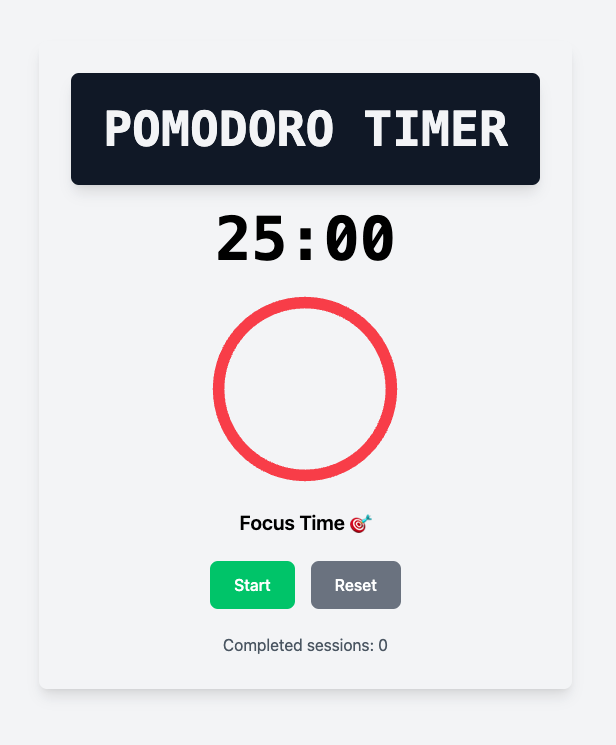

# 🍅 React Pomodoro Timer

[](https://react.dev/)
[](https://tailwindcss.com/)

A productivity-enhancing timer implementing the Pomodoro Technique with visual/audio alerts.

## Screenshot


## Features
- 🎯 **Focus mode** (25 mins)
- ☕ **Short break** (5 mins)
- 🌴 **Long break** (20 mins)
- 🔔 **Audio/visual notifications**
- 📊 **Session counter** (4 focus ➔ long break)

## Installation
```sh
git clone https://github.com/YOURUSERNAME/pomodoro-timer.git
cd pomodoro-timer
npm install
npm start
```

## Usage
1. Press ▶️ to start the timer.
2. Switch modes with the ↻ button.
3. 🔕 Click alert to dismiss notifications.

## Customization
Modify `PomodoroTimer.jsx` to adjust timings:

```js
const getTotalTime = () => {
  switch (mode) {
    case "focus": return 25 * 60; // Edit for focus session duration
    case "short": return 5 * 60; // Short break duration
    case "long": return 20 * 60; // Long break duration
    default: return 25 * 60;
  }
};
```

## Future Roadmap
- [ ] Custom time presets
- [ ] Theme selector
- [ ] Progress visualization

---
Contributions and suggestions are welcome! 🚀

